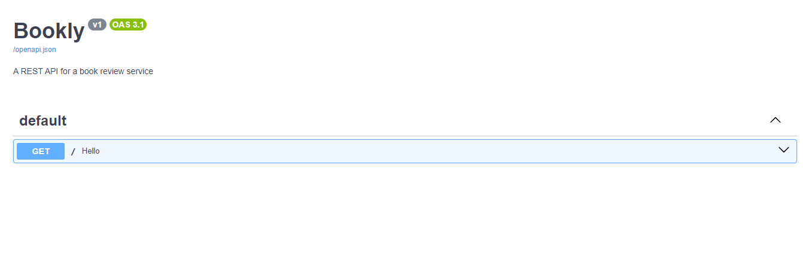
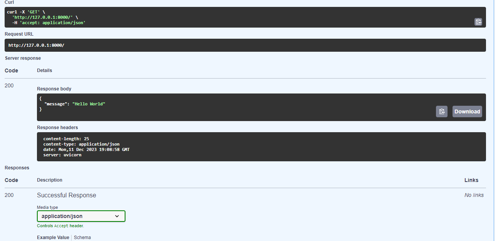

# Creating a simple REST API server and running it
So, I will not waste your time, let us begin by building a simple REST API. Let us call it Bookly. Bookly is a simple REST API for a book review system where users can create a Book entry and get reviews for that book. This is a very simple web application that will help us understand how FastAPI works while also helping us to solve what may seem to be a real world problem.

## Project set-up 
Lt us begin by installing FastAPI. To install FastAPI, it is recommended we begin by creating a virtual environment. A virtual environment will allow us to manage our project dependencies without having to conflict with our system installation of Python. It will also enable us to keep track of the specific versions of dependencies so we can easily share our code with ease.

Start by creating a virtual environment with Python's in built ```virtualenv library```. All modern Python versions come with it as part of the standard library. So it can be accessed via the ```virtualenv``` command. 

Create a folder of your choice by using the following command in your commandline (CMD on windows and Bash on Linux/MacOS).
```
mkdir bookly
```

Enter the project folder with
```
cd bookly/
```

Once in the folder, create a virtual environment with 
```
python -m venv env
```
This will call the `virtualenv` module as a command and create our virtual environment. This will be the folder `env` as we specified in the command.

After creating out virual environment, we shall then activate it so as to install our dependencies.

On windows, we shall write this command.
```bash
C:\Users\jod35> env\Scripts\activate.bat
```
On Linux or MacOS, type the following
```bash
jod35@DESKTOP-7G42BVF:~$ source env/bin/activate
```
Activated virtual environment will look something like this. 
On Windows
```bash
(env) C:\Users\jod35> 
```
On Linux/ MacOS
```bash
(env) jod35@DESKTOP-7G42BVF:~$
```

Once activated, let us now install FastAPI with 
```bash
(env) jod35@DESKTOP-7G42BVF:~$ pip install fastapi
```
Write your project requirements in a `requirements.txt` so that we can keep track of them if we are to use our project with other people.
```bash
(env) jod35@DESKTOP-7G42BVF:~$ pip freeze > requirements.txt
```
This shall create a `requirements.txt` file and it shall look like this.
```python
annotated-types==0.6.0
anyio==3.7.1
click==8.1.7
colorama==0.4.6
exceptiongroup==1.2.0
fastapi==0.104.1
h11==0.14.0
idna==3.6
pydantic==2.5.2
pydantic-core==2.14.5
sniffio==1.3.0
starlette==0.27.0
typing-extensions==4.9.0
uvicorn==0.24.0.post1

```
So now, our current folder structure is something like
```
bookly.
└───env/
|___requirements.txt
```

We shall create a file called `main.py`, and we add the following code.
```python
from fastapi import FastAPI #1


#2
app = FastAPI(
    title="Bookly",
    description="A REST API for a book review service",
    version="v1",
    docs_url="/"
)

#3
@app.get('/')

    return {"message":"Hello World"} #5
```

1. ##Import FastAPI class
In our `main.py` module, we initiate the process by importing the `FastAPI` class.

2. Next, we instantiate the `FastAPI` class to create our `app` object. Within this object, we include essential arguments:
    - `title`: The title displayed on the API documentation.
    - `description`: Details outlining the purpose and functionality of our API.
    - `version`: Specifies the version of our API (set to `v1` for the initial application version).
    - `docs_url`: The path to access the API documentation, set to `/docs`.

3. Utilizing the `app` object, we define an `endpoint`, which represents a path for making requests to the API and receiving responses. To specify the HTTP method used for the request, we use `@app.get` and provide the path (in this case, the root path `/`).

4. Subsequently, we create the function responsible for handling actions upon receiving a request at the defined endpoint. This function, named `hello`, is marked as a coroutine by the addition of `async` at the beginning of its definition.
```python
async def hello(): #4
```

<span>
<span style="color:lightblue">Note </span>A coroutine is a special function that can be paused during its execution to allow other tasks to run. This enables us to write asynchronous code that can handle concurrent tasks without the use of [threads](https://docs.python.org/3/library/threading.html).
</span>

5. Now that we have have defined our coroutine, we need to specify what to return as our response and in our case it will be 
```python
    return {"message":"Hello World"} #5
``` 


So let us now run our server with `uvicorn`. Uvicorn is an ASGI web server for Python and it will help us to run our server. so let us begin by installing it with.
```bash
(env) jod35@DESKTOP-7G42BVF:~$ pip install uvicorn
```

We shall then finally run our server with 
```bash
(env) jod35@DESKTOP-7G42BVF:~$ uvicorn main:app
```

Note that the way we run apps with `uvicorn` is in the format of `<module>:<app_instance>`. In our course, it is goint to be, `main:app`. We shall also provide our `--reload` option to enable the server reload on any change that made in the application code.
```bash
(env) jod35@DESKTOP-7G42BVF:~$  uvicorn main:app --reload
INFO:     Will watch for changes in these directories: ['C:\\Users\\jod35\\Documents\\fastapi-websockets']
INFO:     Uvicorn running on http://127.0.0.1:8000 (Press CTRL+C to quit)
INFO:     Started reloader process [3396] using StatReload
INFO:     Started server process [8052]
INFO:     Waiting for application startup.
INFO:     Application startup complete.   

```
Ou server will run and it will be accessed at `http://127.0.0.1:8000`. So we shall get there by simply pressing `CTRL + Left Click` on Windows and `Command + Click` on MaCOS.

Let us navigate to our API docs at the `/docs` path and make our request.



Let us then finally Click on our request and proceed to make our first API request.



And just like that, You have successfully created your first REST API with FastAPI with FastAPI. This is what we shall build upon until we have final application for this course.